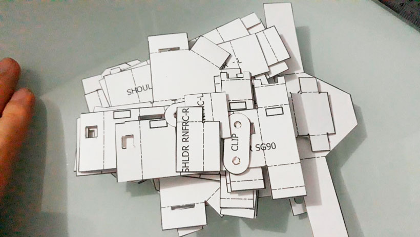
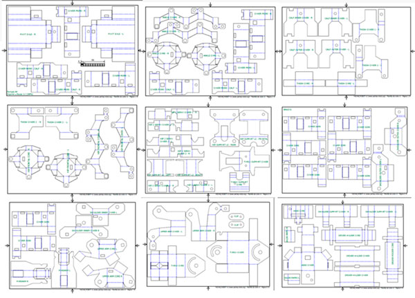
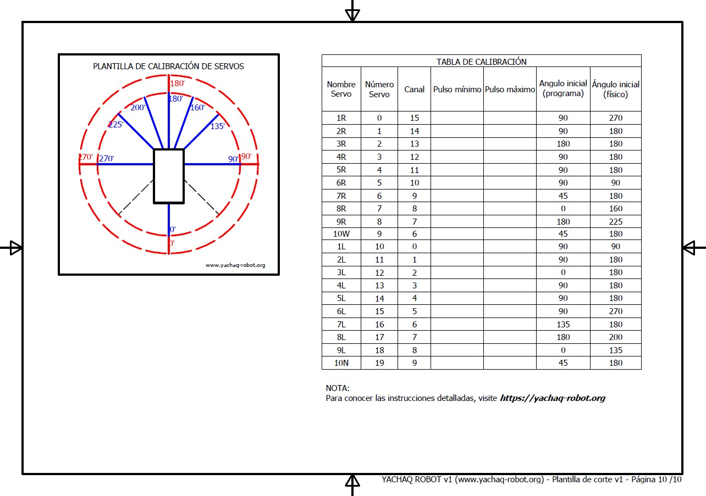
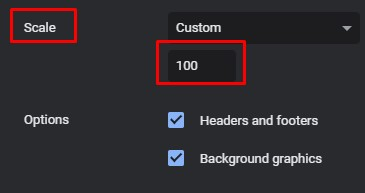
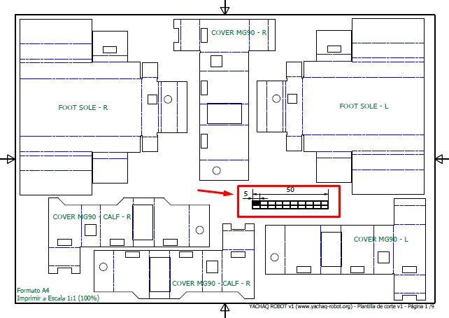
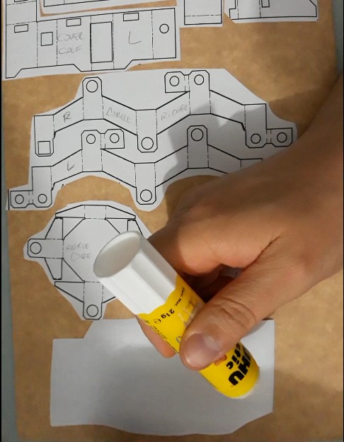

# Etapa 1: Obtener las partes de cartulina

El objetivo de esta etapa es tener todas las piezas de cartulina, recortadas con la forma deseada. Para eso, seguimos los siguientes pasos:

{: width=450 }

## Plantillas

Las plantillas (*templates*) deben imprimirse en papel común, usando una impresora convencional de tinta o láser (da los mismo, para nuestros fines). Puedes descargar las plantillas en su última versión, desde el repositorio oficial: <https://github.com/CarlosNinaOchoa/yachaq-robot>.

{: width=23%}

En este momento, al archivo de plantillas tiene 10 páginas. La última página, es una plantilla para la calibración de los servos. Son todas la piezas que necesitarás.

## Transferir plantilla a cartulina

Una vez descargadas las plantillas en formato PDF, debe imprimirlas en escala 1:1. Es muy importante. Si no repeta la escala no podra ensamblar las piezas y ninguna servirá. 

En algunos programas, la escala se expresa como porcentaje. En ese caso, deberá elegir 100, como valor para imprimir.

Puede asegurarse de que la impresión está en la escala correcta, imprimiendo solo la primera página. en ella, encontrara una regleta. Puede comprobar si dicha medida es realmente de 50mm, como se muestra.

Si es así, entonces la impresión se realizó correctamente y puede imprimir el resto de las páginas. Una vez que haya impreso todas las páginas, puede recortar las piezas, dejando un margen. Esto le permitirá pegar ,ejor esas piezas sobre la cartulina, como ve en la imagen.

Es mejor si adhiere las plantillas a la cara posterior (de color marrón) de la cartulina, de ese modo el resultado tendrá mejor apariencia. siga con este proceso, hasta que haya pegado y recortado *todas las partes* de *todas las páginas*. 

Esto puede tomarle algún tiempo. Recuerde que no es necesario que lo haga todo en un solo día. Tómese un descanso.
En el siguiente video puede ver el proceso.

<iframe width="784" height="441" src="https://www.youtube.com/embed/gA6OLJBBmIo" title="YouTube video player" frameborder="0" allow="accelerometer; autoplay; clipboard-write; encrypted-media; gyroscope; picture-in-picture" allowfullscreen></iframe>

Luego de conseguir las piezas, guardalas donde no se puedan aplastar o doblar.

{: width=85% }

Antes de empezar con el plegado y ensamblado debemos ir a la [Etapa 2: Calibración de servos](../construccion-2).