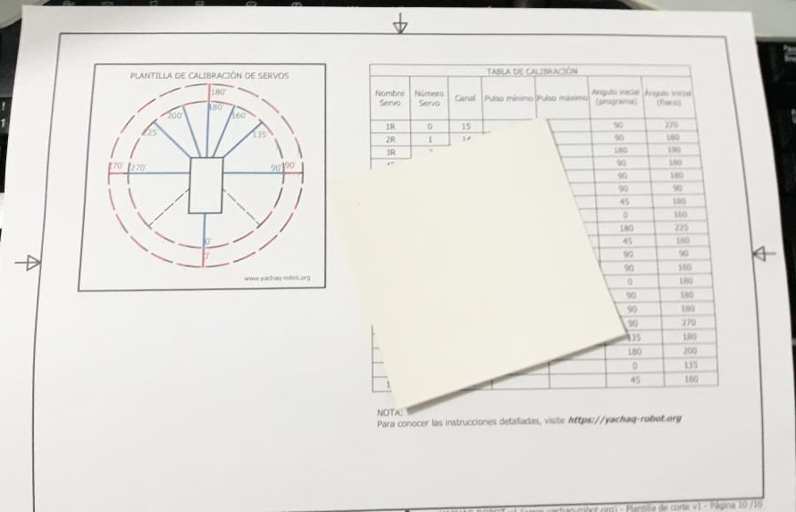
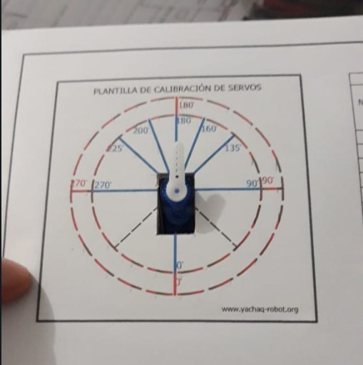
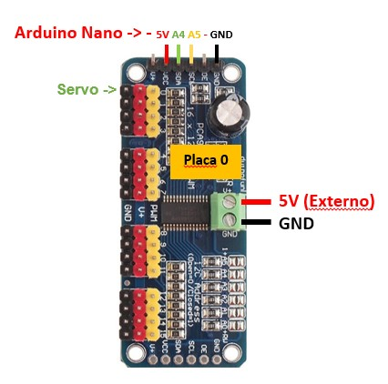
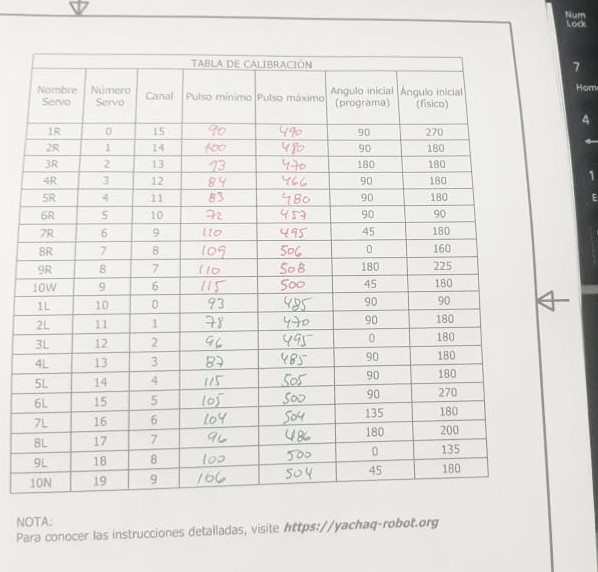
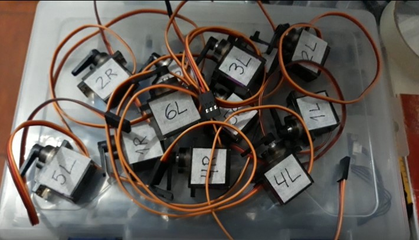
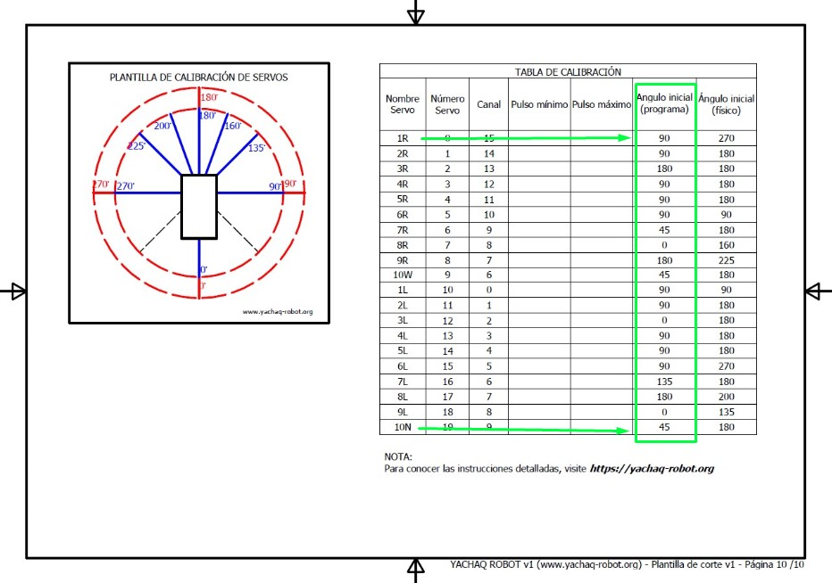
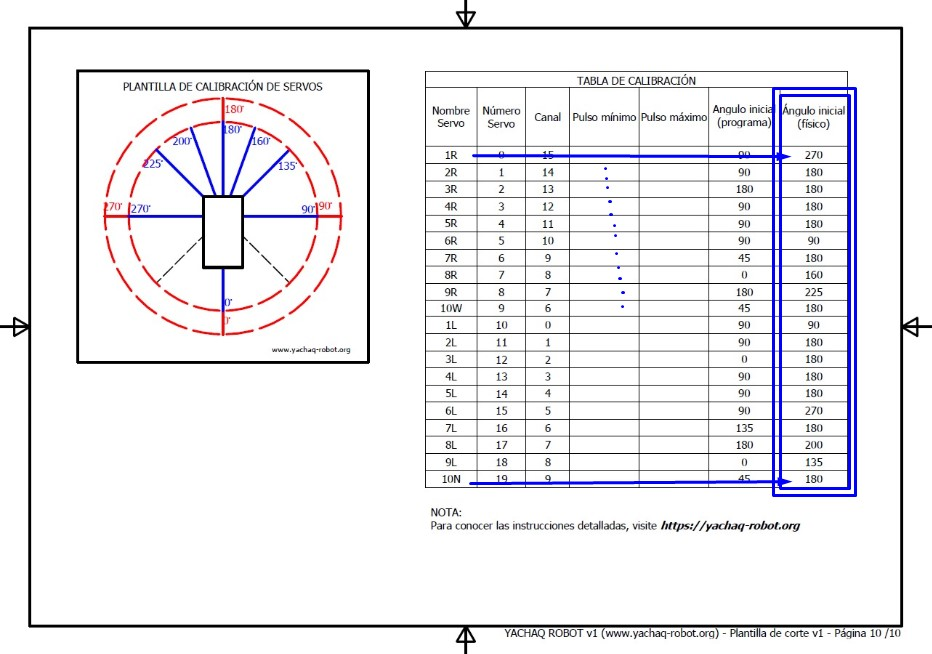

# Etapa 2: Calibración de servos

Para calibrar los servos, necesitaremos la última página de las plantillas usadas antes.

Para evitar que esta plantilla se rompa o deteriore, durante la calibración de los 20 servos, es recomendable pegar una pieza de cartulina en la parte posterior, antes de cortar el rectangulo para introducir el servo.
Tendrás algo similar a lo que ves en la imágen. 

{: align=right, width=55% } {: align=left, width=35%} 

## Objetivo 
Esta plantilla, tiene dos objetivos:

1. Servir de referencia visual para encontrar las posiciones 0 y 180 grados de cada servo **(líneas de color rojo)**. 
2. Ayudar a poner los ejes de los servos en su posición inicial correcta **(líneas en azul)**.

Para lograr el objetivo, debemos poder controlar al servo. Esto es más fácil hacer, usando un *Arduino* en lugar del *ESP32CAM*. En mi caso, usé un *Arduino Nano*, pero podrías usar cualquier versión. La conexión es como muestra el esquema:

## Conexión

Debes notar que estamos conectando el servo al **canal 0** del driver *PCA9685*.

## Programa

El programa hace que el servo vaya de un ángulo 0 a 90 a 180 grados de manera secuencial y con un tiempo de espera de 2000 milisegundos entre esas posiciones. Esto es suficiente para puedas observar si el servo, realmente alcanza esas posiciones. Al principio, por supuesto, eso no pasará :D

Luego de conectar todo, debemos cargar el programa al *Arduino Nano*, pero antes debemos instalar la [librería del driver PCA9685](https://github.com/adafruit/Adafruit-PWM-Servo-Driver-Library). Esto es muy importante.

    /****************************************************
    Código para calibración y seteo de angulo inicial de servomotores 
    con driver PCA9685, servomotor conectado en canal 0  

    Conexión:
    PCA9685 ->  Arduino Nano
    GND -> GND
    OE  ->
    SCL ->  A5
    SDA ->  A4
    VCC ->  5V
    V+  ->  [Fuente externa]
    ****************************************************/
    
    #include <Wire.h>
    #include <Adafruit_PWMServoDriver.h>
    // called this way, it uses the default address 0x40
    Adafruit_PWMServoDriver pwm = Adafruit_PWMServoDriver();
    #define SERVO_FREQ 50 // Analog servos run at ~50 Hz updates
    uint8_t servonum = 0;

    void setup() {

    pwm.begin();
    pwm.setOscillatorFrequency(27000000);
    pwm.setPWMFreq(SERVO_FREQ);  

    delay(10);
    }

    void loop() {

    int minimo = 150;   //--- **Pulso mínimo**: posición 0 grados
    int maximo = 500;   //--- **Pulso máximo**: posición 180 grados

    //Descomentar ang_rel_inicial, luego de la calibración y usar valores de tabla
    //int ang_inicial_programa = 45; //cambiar según valor de **Angulo inicial (programa)**

    for(int cont=1; cont<=2; cont++){
        pwm.setPWM(0, 0, AnguloAPulso(0,minimo,maximo));
        delay(2000);
        pwm.setPWM(0, 0, AnguloAPulso(90,minimo,maximo));
        delay(2000);
        pwm.setPWM(0, 0, AnguloAPulso(180,minimo,maximo));
        delay(2000);
    }
        // Descomentar para seteo de Angulo inicial, para cada servomotor.
        //pwm.setPWM(0, 0, AnguloAPulso(ang_inicial_programa,minimo,maximo));
        //delay(30000);
    }

    //Función que mapea los valores de angulo (0 a 180 grados) 
    //hacia valores de pulso, entre el minimo y maximo definidos

    int AnguloAPulso (int angulo, int minimo, int maximo) {
    int pulso = map(angulo, 0, 180, minimo, maximo);
    return pulso;  
    }

    
La parte del código que nos importa es: 

    int minimo = 150;   //150--- **Pulso mínimo**: posición 0 grados
    int maximo = 500;   //500--- **Pulso mínimo**: posición 180 grados

Ya que aquí estamos definiendo los valores de *pulso mínimo* y *pulso máximo*; valores que mueven el eje del servo a las posiciones *0 grados* y *180 grados*, respectivamente. 
Mi recomendación es que primero cargue estos valores. 

## Calibración

A partir de aquí, deberas reducir poco a poco el valor de *pulso mínimo* (y cargando el programa cada vez). **Hasta que notes que el servo deja de responder**. En ese punto, has encontrado el límite inferior del servo, es decir, su punto cero. Aumenta el valor de *pulso mínimo* nuevamente al menor valor posible que haga que el servo responda (es decir, que se mueva). **Ese sera el valor de *pulso minimo* de ese servo**.

Lo siguiente es muy importante. Cuando el servo alcance el estado anterior, desconecte la energía. Retire el eje del sevo y coloquelo de tal manera que **apunte en la dirección 0 grados**. Vuelva a conectar la energía. 

Notará que el servo se mueve desde **0 grados** hasta algún valor cercano a 180. Ahora deberea modificar poco a poco el valor de *pulso máximo* (y cargando el porgrama cada vez). **Hasta que el servo se mueva de 0 a 180 grados**. El valor que haga que el servo alcance la posición de 180 grados, sera el valor de ***pulso máximo***.

De este modo, ha encontrado los valores para ***pulso mínimo*** y ***pulso máximo***, para especificamente el servo que usó. Estos valores són únicos para cada servo! 

Felicitaciones. Ya tiene un servo calibrado. Solo faltan 19... Pero no te desalientes. Para hacerlo más interesante, puedes colocar los valores en la *Tabla de calibración* que tienes en la plantilla. Verás que hay espacios en blanco, esperando que los completes.  

No caigas en la tentación de usar los valores de la imágen. Cada servo es diferente, como puedes ver.

Y no olvides rotular los servos! Puedes usar el nombre de la *Tabla de calibración*. Así los identificaremos en esta dicumentación.

{: width=60% }

## Configurar la posición inicial 

Una vez que haya definido los valores de ***pulso mínimo*** y ***pulso máximo***, deberá colocar cada servo en su posición inicial específica. Este procedimiento tiene dos pasos.

1. Programar la posición inicial.
2. Retirar el eje y colocarlo en la posición inicial.

### Paso 1: 

Modificar el programa anterior, comentando el lazo *for* y dejando activa solo las lineas para mover el servo hasta una posición fija. El programa quedaría de este modo:

    /****************************************************
    Código para calibración y seteo de angulo inicial de servomotores 
    con driver PCA9685, servomotor conectado en canal 0  

    Conexión:
    PCA9685 ->  Arduino Nano
    GND -> GND
    OE  ->
    SCL ->  A5
    SDA ->  A4
    VCC ->  5V
    V+  ->  [Fuente externa]
    ****************************************************/
    
    #include <Wire.h>
    #include <Adafruit_PWMServoDriver.h>
    // called this way, it uses the default address 0x40
    Adafruit_PWMServoDriver pwm = Adafruit_PWMServoDriver();
    #define SERVO_FREQ 50 // Analog servos run at ~50 Hz updates
    uint8_t servonum = 0;

    void setup() {

    pwm.begin();
    pwm.setOscillatorFrequency(27000000);
    pwm.setPWMFreq(SERVO_FREQ);  

    delay(10);
    }

    void loop() {

    int minimo = 150;   //--- **Pulso mínimo**: posición 0 grados
    int maximo = 500;   //--- **Pulso máximo**: posición 180 grados

    //Descomentar ang_rel_inicial, luego de la calibración y usar valores de tabla
    int ang_inicial_programa = 45; //cambiar según valor de la tabla **Angulo inicial (programa)**
    /*
    for(int cont=1; cont<=2; cont++){
        pwm.setPWM(0, 0, AnguloAPulso(0,minimo,maximo));
        delay(2000);
        pwm.setPWM(0, 0, AnguloAPulso(90,minimo,maximo));
        delay(2000);
        pwm.setPWM(0, 0, AnguloAPulso(180,minimo,maximo));
        delay(2000);
    }
    */
        // Descomentar para seteo de Angulo inicial, para cada servomotor.
        pwm.setPWM(0, 0, AnguloAPulso(ang_inicial_programa,minimo,maximo));
        delay(30000);
    }

    //Función que mapea los valores de angulo (0 a 180 grados) 
    //hacia valores de pulso, entre el minimo y maximo definidos

    int AnguloAPulso (int angulo, int minimo, int maximo) {
    int pulso = map(angulo, 0, 180, minimo, maximo);
    return pulso;  
    }

En este caso, la parte importante es:

    int minimo = 150;   //--- **Pulso mínimo**: posición 0 grados
    int maximo = 500;   //--- **Pulso máximo**: posición 180 grados

    //Descomentar ang_rel_inicial, luego de la calibración y usar valores de tabla
    int ang_inicial_programa = 45; //cambiar según valor de la tabla **Angulo inicial (programa)**

Aquí colocamos los valores que encontramos anteriormente, para ***pulso mínimo*** y ***pulso máximo***. Además, lo más importante, definimos el valor ***ang_inicial_programa***, según el que le corresponda en la ***Tabla de calibración***, para el servo que estemos configurando. Por ejemplo, para el *servo 1R -> 90 grados*. Para el *servo 7R -> 45 grados*.

{: width=90% }

El programa, colocará el servo en la posición adecuada y lo dejará listo para el ensamble del robot. Pero antes de terminar con este servo, debes completar el segundo paso.

### Paso 2: 

Esto es relativamente simple si estás usando la plantilla de calibración. Una vez que tengas el servo en la posición anterior, ***debes retirar el eje del servo***. Ten cuidado de no rotarlo. Luego, debes ***volver a colocar el eje*** en la dirección que indique la *Tabla de calibración* en la columna ***Ángulo inicial (físico)***. Por ejemplo, para el *servo 1R -> 270 grados*. Para el *servo 7R -> 180 grados*. 

{: width=90% }

En la plantilla, están marcados con líneas azules las orientaciones que utilizará en este paso. Esto facilitará su trabajo. Eso es todo para este servo, ahora puede continuar con los otros 19. 

Luego de esto, puedes (y te mereces) tomar un descanso. Siéntete orgullos@ de haber llegado hasta aquí. y preparate para la siguiente etapa: [Etapa 3 : Plegado y pegado](../construccion-3).