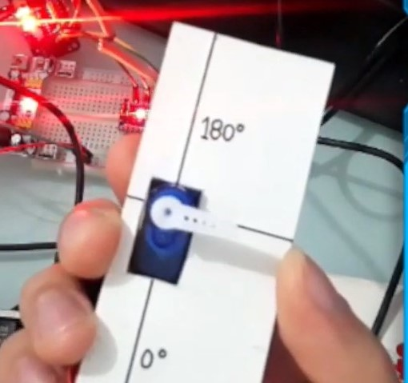

# Etapa 2: Calibración de servos

Para calibrar los servos, haremos uso de la última página de las plantillas usadas antes. En esta plantilla, deberás recortar el recuadro izquierdo, para hacer encajar el servomotor. 

Tendrás algo similar a lo que ves en la imágen. 

En la imágen usé una pieza de cartulina simple, pero para mejorar el proceso  y hacerlo más simple, he creado la plantilla anterior, que te recomiendo usar.

Una vez que hayas instalado la [librería del driver PCA9685](https://github.com/adafruit/Adafruit-PWM-Servo-Driver-Library), puedes cargar este código para empezar con la calibración:

    
    /****************************************************
    Código para calibración y seteo de angulo inicial de servomotores 
    con driver PCA9685, servomotor conectado en canal 0  

    Conexión:
    PCA9685 ->  Arduino Nano
    GND -> GND
    OE  ->
    SCL ->  A5
    SDA ->  A4
    VCC ->  5V
    V+  ->  [Fuente externa]
    ****************************************************/
    
    #include <Wire.h>
    #include <Adafruit_PWMServoDriver.h>
    // called this way, it uses the default address 0x40
    Adafruit_PWMServoDriver pwm = Adafruit_PWMServoDriver();
    #define SERVO_FREQ 50 // Analog servos run at ~50 Hz updates
    uint8_t servonum = 0;

    void setup() {

    pwm.begin();
    pwm.setOscillatorFrequency(27000000);
    pwm.setPWMFreq(SERVO_FREQ);  

    delay(10);
    }

    void loop() {

    int minimo = 150;   //150--- **Pulso mínimo**: posición 0 grados
    int maximo = 500;   //500--- **Pulso mínimo**: posición 180 grados

    //Descomentar ang_rel_inicial, luego de la calibración y usar valores de tabla
    //int ang_inicial_programa = 45; //cambiar según valor de **Angulo inicial (programa)**

    for(int cont=1; cont<=2; cont++){
        pwm.setPWM(0, 0, AnguloAPulso(0,minimo,maximo));
        delay(2000);
        pwm.setPWM(0, 0, AnguloAPulso(90,minimo,maximo));
        delay(2000);
        pwm.setPWM(0, 0, AnguloAPulso(180,minimo,maximo));
        delay(2000);
    }
        // Descomentar para seteo de Angulo inicial, para cada servomotor.
        //pwm.setPWM(0, 0, AnguloAPulso(ang_inicial_programa,minimo,maximo));
        delay(30000);
    }

    //Función que mapea los valores de angulo (0 a 180 grados) 
    //hacia valores de pulso, entre el minimo y maximo definidos

    int AnguloAPulso (int angulo, int minimo, int maximo) {
    int pulso = map(angulo, 0, 180, minimo, maximo);
    return pulso;  
    }

    

