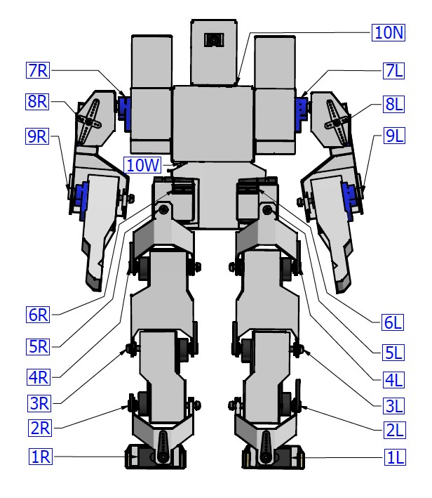

# Etapa 3: Plegado y pegado

En esta etapa detallaremos como plegar las piezas de cartulina y como unirlas a los servos. La recomendación es trabajar esto por partes. Aquí describiré como plegar las piezas desde abajo hacia arriba, es decir, desde los pies a la cabeza. 

Se describen aquí las piezas del lado derecho del robot. Naturalmente, las del lado izquierdo son simetricas a éstas.

## Pie

### Piezas necesarias

### Proceso de plegado

### Proceso de pegado

## Tobillo

### Piezas necesarias

### Proceso de plegado

### Proceso de pegado

## Pantorrilla

### Piezas necesarias

### Proceso de plegado

### Proceso de pegado

## Muslo

### Piezas necesarias

### Proceso de plegado

### Proceso de pegado

## Articulación de cadera

### Piezas necesarias

### Proceso de plegado

### Proceso de pegado

## Servos de cadera

### Piezas necesarias

### Proceso de plegado

### Proceso de pegado

## Pelvis

### Piezas necesarias

### Proceso de plegado

### Proceso de pegado

## Soporte de torax

### Piezas necesarias

### Proceso de plegado

### Proceso de pegado

## Tórax

### Piezas necesarias

### Proceso de plegado

### Proceso de pegado

## Soporte de brazo

### Piezas necesarias

### Proceso de plegado

### Proceso de pegado

## Hombro

### Piezas necesarias

### Proceso de plegado

### Proceso de pegado

## Brazo

### Piezas necesarias

### Proceso de plegado

### Proceso de pegado

## Antebrazo

### Piezas necesarias

### Proceso de plegado

### Proceso de pegado

## Cabeza

### Piezas necesarias

### Proceso de plegado

### Proceso de pegado

