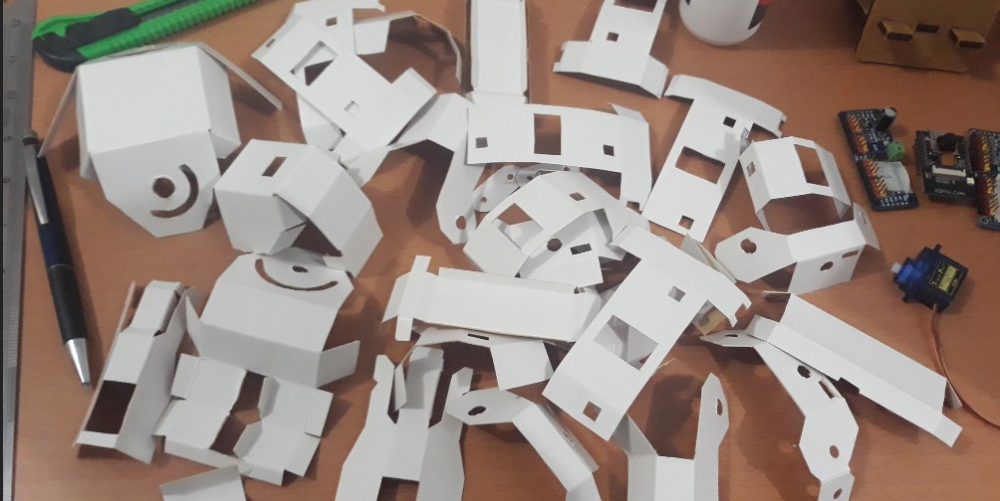
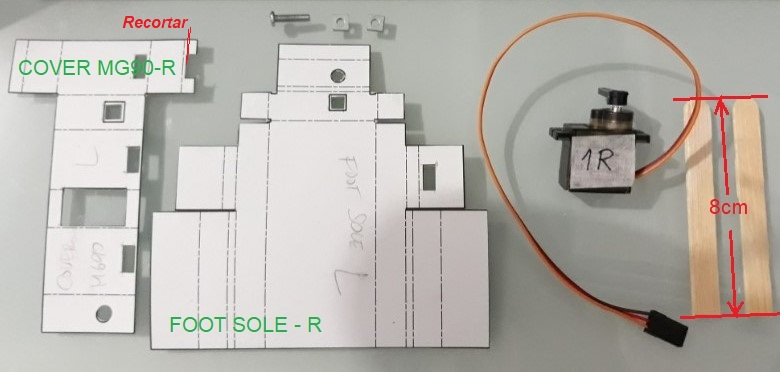
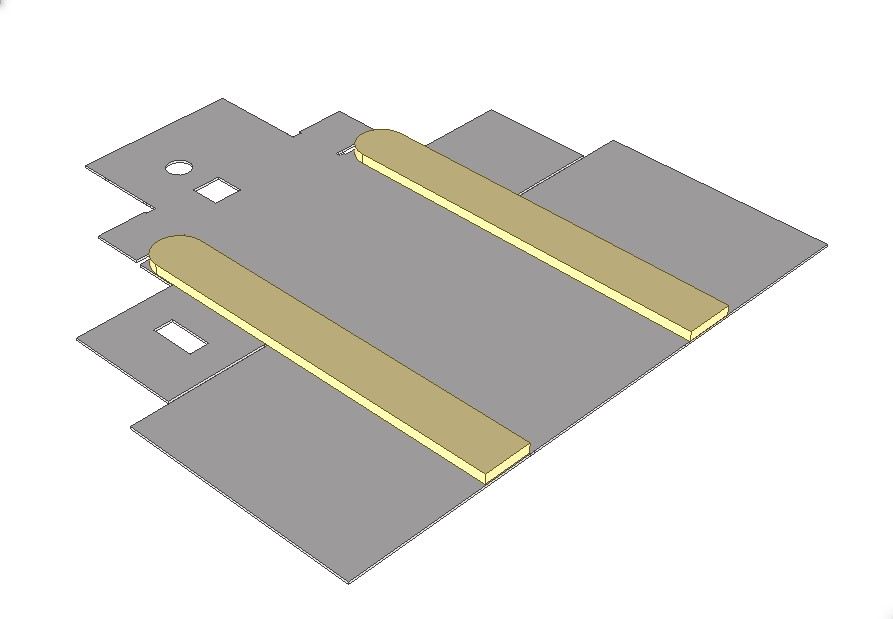
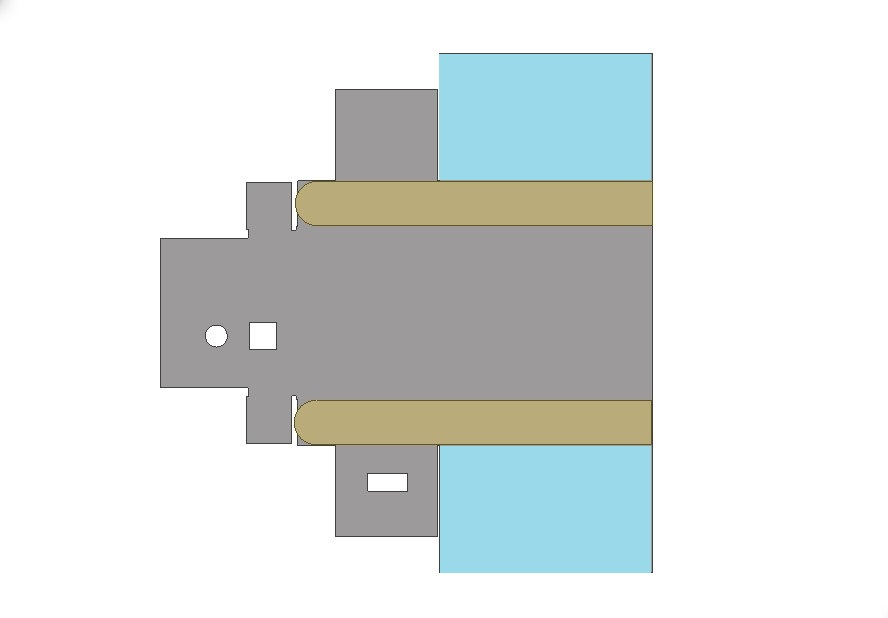
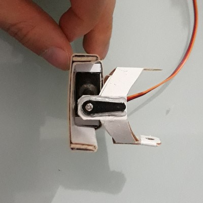
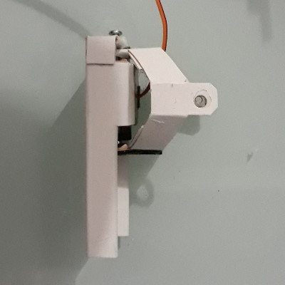
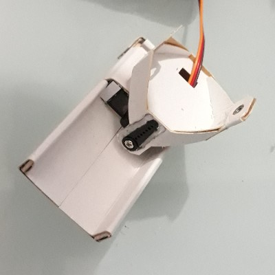
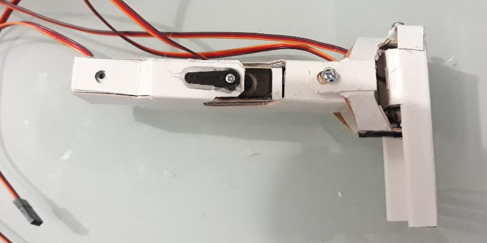
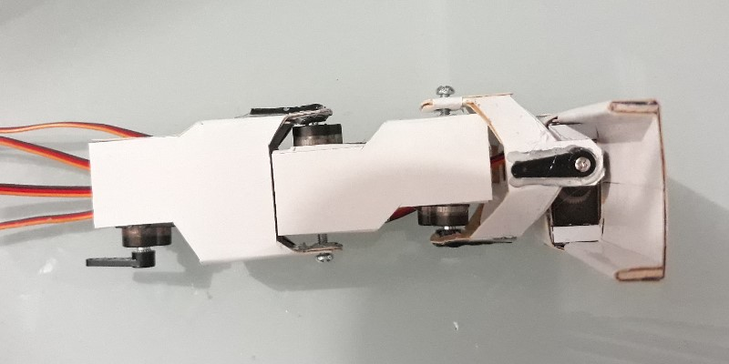

# Etapa 3: Plegado y pegado

En esta etapa detallaremos como plegar las piezas de cartulina y como unirlas a los servos. La recomendación es trabajar esto por partes. Aquí describiré como plegar las piezas desde abajo hacia arriba, es decir, desde los pies a la cabeza. 

***Se describen aquí las piezas del lado derecho del robot. Naturalmente, las del lado izquierdo son simetricas a éstas***.

## Pie

### Piezas necesarias para el pie
Para el pie derecho, necesitaremos las piezas nombradas:

 - 1 x Foot-Sole-R
 - 1 x Cover MG90-R
 - 2 x palitos de helado (recortados a 8cm)
 - 2 x tuercas cuadradas de 1/8"
 - ***1 x Servo 1R***

 

*\*Hay un pequeño recorte que debe hacer, como se ve en la imágen. Se corregirá pronto.*

Para el pie izquierdo, necesitaremos las piezas nombradas:

 - 1 x Foot-Sole-L
 - 1 x Cover MG90-L
 - 2 x palitos de helado (recortados a 8cm)
 - 2 x tuercas cuadradas de 1/8"
 - ***1 x Servo 1L***

Como verás, las piezas del lado derecho tienen una letra *R* (*right*) y las del lado izquierdo una letra *L* (*left*). Este patrón es el mismo para las demás piezas.

### Proceso de pegado de servo

El proceso de colocar esta *"funda"* a los servos, es prácticamente el mismo para los 20 servomotres, así que puedes considerar el siguiente procedimiento como general. Aquí verás un video que muestra el proceso.

<iframe width="95%" height="441" src="https://www.youtube.com/embed/u9cq8NnvBbY" title="YouTube video player" frameborder="0" allow="accelerometer; autoplay; clipboard-write; encrypted-media; gyroscope; picture-in-picture" allowfullscreen></iframe>

### Proceso de ensamble de pie

Para ver un resumen del proceso, puedes ver este video.

<iframe width="95%" height="441" src="https://www.youtube.com/embed/e6XJL1mVsxk" title="YouTube video player" frameborder="0" allow="accelerometer; autoplay; clipboard-write; encrypted-media; gyroscope; picture-in-picture" allowfullscreen></iframe>

Para empezar, tomamos la pieza ***Foot Sole R*** y realizamos un plegado, siguiendo los pasos vistos en el video.

Luego de haber realizado el plegado, tomamos la pieza ***Foot Sole R*** y colocamos cola en la zona marcada en celeste y debajo de donde se colocara el *palito de helado* recortado a 8cm. Como se muestra en la figura.

{: align=left, width=48% } {: align=right, width=48% } 

*Es recomendable, aplicar cola también en el palito de helado y dejar secar un poco ambas superfices, por unos pocos segundos antes de unirlas.*

## Tobillo

### Piezas necesarias para el tobillo

Para ensamblar el tobillo, se necesitan las piezas de nombre:

- 1 x Ankle Core R
- 1 x Ankle Cover R
- 2 x tuercas cuadradas de 1/8"

### Proceso de plegado y pegado del tobillo

Este video muestra el proceso de plegado y pegado del tobillo. Esta es una articulación *"pasiva"*, ya que no contiene un servo, sino que conecta a otras partes que si tienen servos.

Para esta pieza, plegamos las partes y las unimos ***con cola***. Es importante hacerlo con cola y ***no con silicona caliente***. Esto es porque conseguir la posición correcta de las partes toma unos segundos y la silicona caliente seca demasiado rápido. Si eso pasa, tendríamos la pieza mal armada y tendríamos que volver a hacerla.

<iframe width="95%" height="441" src="https://www.youtube.com/embed/_IiMpUz_Xdc" title="YouTube video player" frameborder="0" allow="accelerometer; autoplay; clipboard-write; encrypted-media; gyroscope; picture-in-picture" allowfullscreen></iframe>

## Ensamble de articulación Pie y Tobillo

### Piezas necesarias para la articulación pie - tobillo

- 1 x Tobillo armado en el paso anterior (Ankle core R / Ankle Cover R)
- 1 x Pie armado en los pasos anteriores
- 1 x Perno stove bolt 1/8"
- 1 x Eje y perno de servomotor MG90s

### Proceso de ensamble pie-tobillo

Una vez que tenemos listos el pie y el tobillo, podemos realizar el ensamble de ambos. Esta será la primera unión entre piezas móviles. 

**Algo muy importante**: Al insertar el *Stove bolt 1/8"*, ten cuidado de ***no ajustarlo***. Apenas sientas que el perno ha llegado al final, debes dejar de girarlo. Si lo ajustas, aunque sea un poco, dañaras el pie y deberás rehacer la pieza. El tornillo que fija el eje del servo (al servo) si debe ajustarse.

<iframe width="95%" height="441" src="https://www.youtube.com/embed/EvuIxHkE0FE" title="YouTube video player" frameborder="0" allow="accelerometer; autoplay; clipboard-write; encrypted-media; gyroscope; picture-in-picture" allowfullscreen></iframe>

Ten en cuenta, que para este momento, el servo 1R ya ***debe estar calibrado*** y debe estar en su ***posición inicial***. Si no lo está, vuelve a la [Etapa 2 : Calibración de servos](../construccion-2), para calibrarlos todos.

El resultado final se vera así.

{: align=left, width=32% } {: align=right, width=32% } {: align=right, width=32% } 

## Pantorrilla

La siguiente parte por armar será la pantorrilla. Empecemos!

### Piezas necesarias para la pantorrilla

- 2 x Cover MG90 Calf R
- 1 x Calf inner cover R
- 1 x Calf outer cover R
- 2 x tuercas cuadradas 1/8"

### Proceso de plegado y pegado de pantorrilla

El poceso de armado de la pantorrilla, se resume en el siguiente video.

<iframe width="95%" height="441" src="https://www.youtube.com/embed/KLAAYkVzR4Y" title="YouTube video player" frameborder="0" allow="accelerometer; autoplay; clipboard-write; encrypted-media; gyroscope; picture-in-picture" allowfullscreen></iframe>

## Muslo

### Piezas necesarias para el muslo

- 1 x Thigh cover 1 R
- 1 x Thigh cover 2 R
- 1 x Thigh core R
- 1 x tuerca cuadrada 1/8"

### Proceso de plegado y pegado de muslo

El poceso de armado de la muslo, se resume en el siguiente video.

<iframe width="95%" height="441" src="https://www.youtube.com/embed/NqS5jEvhve4" title="YouTube video player" frameborder="0" allow="accelerometer; autoplay; clipboard-write; encrypted-media; gyroscope; picture-in-picture" allowfullscreen></iframe>

## Ensamble de articulación Pantorrilla y Muslo (rodilla)

Ahora que tenemos listo el muslo, procedemos a ensamblarlo con las partes anteriores (pie y pantorrilla). Esta es la segunda articulación del robot.

### Piezas necesarias para articulación de rodilla

- 1 x Pantorrilla/Pie ensamblada
- 1 x Muslo armado
- 1 x Perno *Stove bolt* 1/8"
- 1 x Eje de servo MG90s con perno

### Proceso de ensamble de rodilla

**Algo muy importante**: Al insertar el perno *Stove bolt 1/8"*, ten cuidado de ***no ajustarlo***. Apenas sientas que el perno ha llegado al final, debes dejar de girarlo. Si lo ajustas, aunque sea un poco, dañaras la pieza y deberás rehacerla. El tornillo que fija el eje del servo (al servo) si debe ajustarse.

<iframe width="95%" height="441" src="https://www.youtube.com/embed/8hbxpq_X9C0" title="YouTube video player" frameborder="0" allow="accelerometer; autoplay; clipboard-write; encrypted-media; gyroscope; picture-in-picture" allowfullscreen></iframe>

Aqui puedes ver como va tomando forma. Ya parece una pierna. 

{: align=left, width=48% } {: align=right, width=48% } 

Lo siguiente será seguir con la articulación que une el muslo con la cadera.

## Articulación de cadera

La siguiente pieza se parece mucho al tobillo. Esta hecha de dos partes de cartulina. Empecemos!

### Piezas necesarias para la articulación de cadera

- 1 x Hip frontal core R
- 1 x Hip frontal cover R
- 2 x Tuerca cuadrada 1/8"

### Proceso de plegado y pegado de la articulación de cadera

Para esta pieza, similar al tobillo, plegamos las partes y las unimos ***con cola***. Es importante hacerlo con cola y ***no con silicona caliente***. Esto es porque conseguir la posición correcta de las partes toma unos segundos y la silicona caliente seca demasiado rápido. Si eso pasa, tendríamos la pieza mal armada y tendríamos que volver a hacerla.

<iframe width="95%" height="441" src="https://www.youtube.com/embed/mw5cKjZrmkE" title="YouTube video player" frameborder="0" allow="accelerometer; autoplay; clipboard-write; encrypted-media; gyroscope; picture-in-picture" allowfullscreen></iframe>

## Servos de cadera

Esta parte es muy particular. Es la unión de dos servos, de manera que sus ejes queden perpendiculares entre si. Este arreglo permite que la cadera sea mas estrecha y mantenga en el robot una mejor apariencia (una apariecncia más humanoide).

### Piezas necesarias

- 1 x Hip 2 Servo Cover 1 R
- 1 x Hip 2 Servo Cover 2 R
- 1 x Hip 2 Servo Cover 3 R
- 2 x Tuerca cuadrada 1/8"

### Proceso de plegado y pegado 

Hasta este punto, se realizaron grabaciones del proceso :/ Pero la explicación del siguiente video esta hecha a aprtir del modelo 3D, así que estoy seguro que será suficientemente clara.

<iframe width="95%" height="481" src="https://www.youtube.com/embed/lhV4XKFMjPg" title="YouTube video player" frameborder="0" allow="accelerometer; autoplay; clipboard-write; encrypted-media; gyroscope; picture-in-picture" allowfullscreen></iframe>

### Proceso de ensamble de pierna y cadera

<iframe width="95%" height="481" src="https://www.youtube.com/embed/3ia0gOGuepc" title="YouTube video player" frameborder="0" allow="accelerometer; autoplay; clipboard-write; encrypted-media; gyroscope; picture-in-picture" allowfullscreen></iframe>

## Pelvis

### Piezas necesarias

### Proceso de plegado y pegado 

<iframe width="95%" height="481" src="https://www.youtube.com/embed/9UVAFX9vthI" title="YouTube video player" frameborder="0" allow="accelerometer; autoplay; clipboard-write; encrypted-media; gyroscope; picture-in-picture" allowfullscreen></iframe>

## Soporte de torax

### Piezas necesarias

### Proceso de plegado

### Proceso de pegado

## Tórax

### Piezas necesarias

### Proceso de plegado

### Proceso de pegado

## Soporte de brazo

### Piezas necesarias

### Proceso de plegado

### Proceso de pegado

## Hombro

### Piezas necesarias

### Proceso de plegado

### Proceso de pegado

## Brazo

### Piezas necesarias

### Proceso de plegado

### Proceso de pegado

## Antebrazo

### Piezas necesarias

### Proceso de plegado

### Proceso de pegado

## Cabeza

### Piezas necesarias

### Proceso de plegado

### Proceso de pegado

