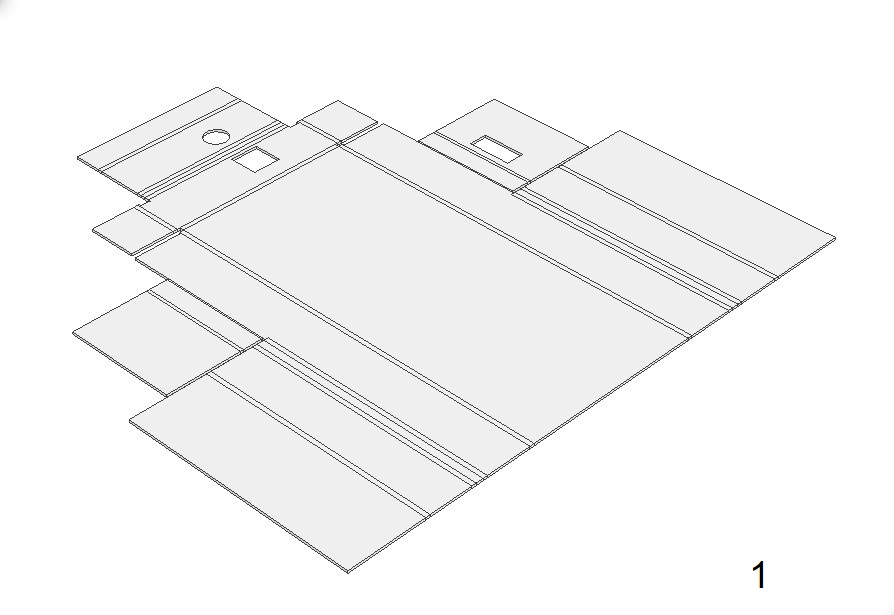
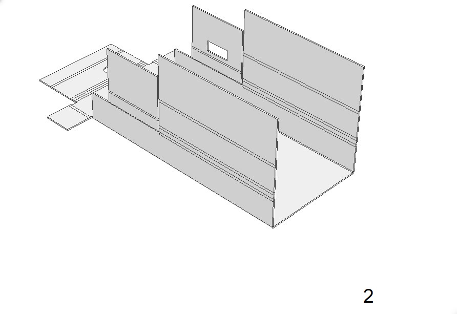
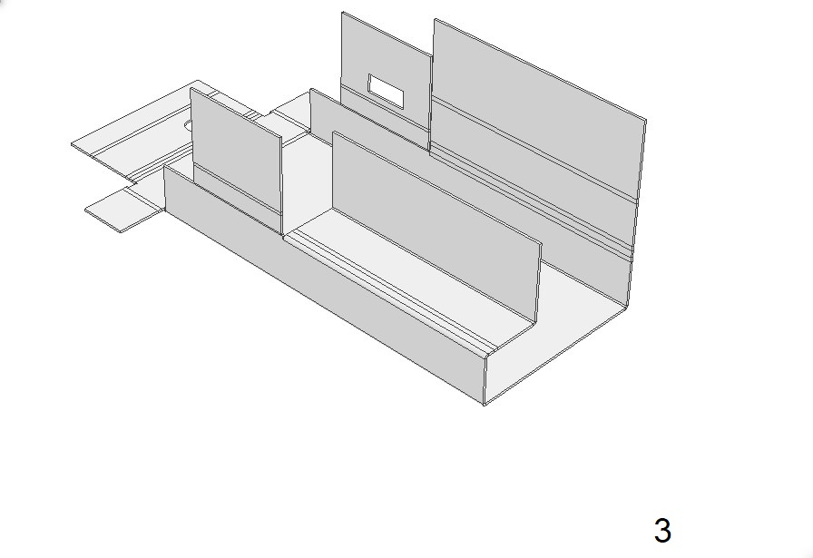
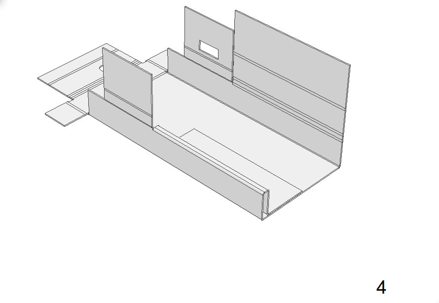
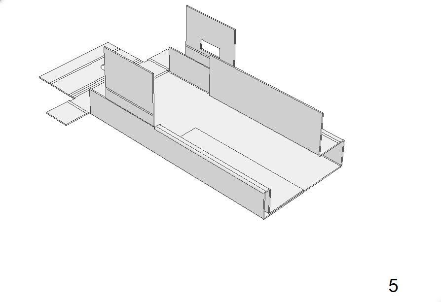
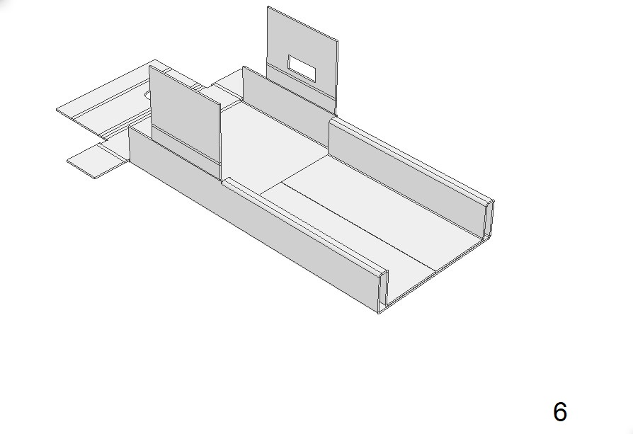
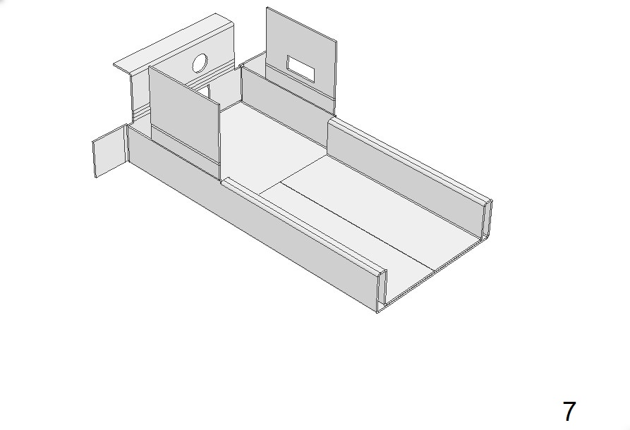
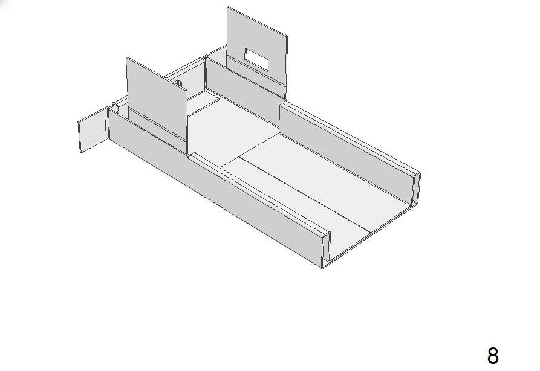
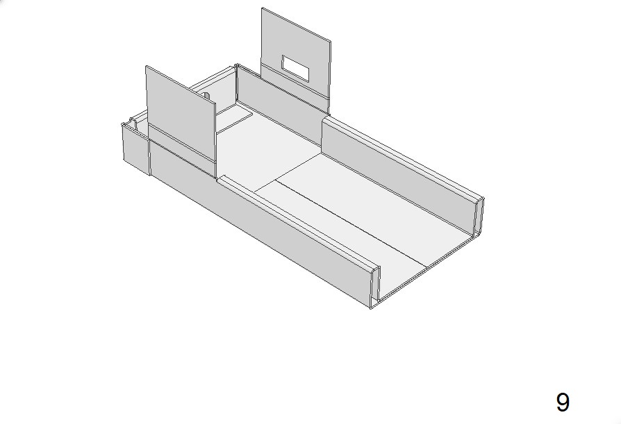
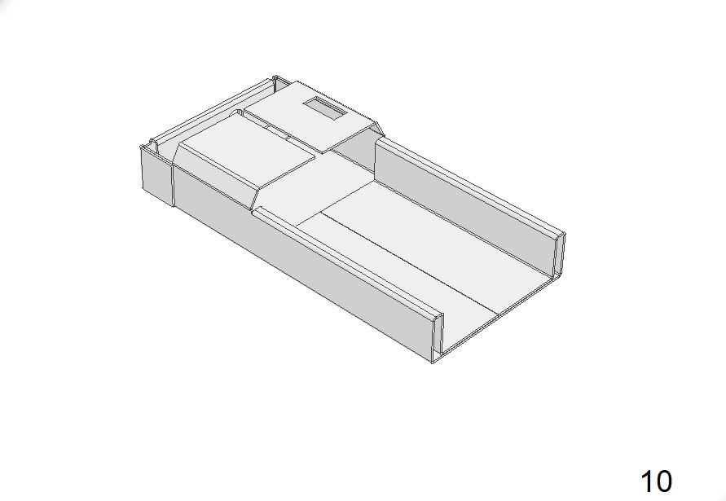

# Etapa 3: Plegado y pegado

En esta etapa detallaremos como plegar las piezas de cartulina y como unirlas a los servos. La recomendación es trabajar esto por partes. Aquí describiré como plegar las piezas desde abajo hacia arriba, es decir, desde los pies a la cabeza. 

***Se describen aquí las piezas del lado derecho del robot. Naturalmente, las del lado izquierdo son simetricas a éstas***.

## Pie

### Piezas necesarias para el pie
Para el pie derecho, necesitaremos las piezas nombradas:

 - 1 x Foot-Sole-R
 - 1 x Cover MG90-R
 - 2 x palitos de helado (recortados a 8cm)
 - 2 x tuercas cuadradas de 1/8"
 - ***1 x Servo 1R***

 

*\*Hay un pequeño recorte que debe hacer, como se ve en la imágen. Se corregirá pronto.*

Para el pie izquierdo, necesitaremos las piezas nombradas:

 - 1 x Foot-Sole-L
 - 1 x Cover MG90-L
 - 2 x palitos de helado (recortados a 8cm)
 - 2 x tuercas cuadradas de 1/8"
 - ***1 x Servo 1L***

Como verás, las piezas del lado derecho tienen una letra *R* (*right*) y las del lado izquierdo una letra *L* (*left*). Este patrón es el mismo para las demás piezas.

### Proceso de pegado de servo

El proceso de colocar esta *"funda"* a los servos, es prácticamente el mismo para los 20 servomotres, así que puedes considerar el siguiente procedimiento como general. Aquí verás un video que muestra el proceso.

<iframe width="784" height="441" src="https://www.youtube.com/embed/u9cq8NnvBbY" title="YouTube video player" frameborder="0" allow="accelerometer; autoplay; clipboard-write; encrypted-media; gyroscope; picture-in-picture" allowfullscreen></iframe>

### Proceso de ensamble de pie

Para ver un resumen del proceso, puedes ver este video.

<iframe width="784" height="441" src="https://www.youtube.com/embed/e6XJL1mVsxk" title="YouTube video player" frameborder="0" allow="accelerometer; autoplay; clipboard-write; encrypted-media; gyroscope; picture-in-picture" allowfullscreen></iframe>

Para empezar, tomamos la pieza ***Foot Sole R*** y realizamos un plegado, siguiendo los pasos siguientes.

{: align=left, width=48% } {: align=right, width=48% } 
{: align=left, width=48% } {: align=right, width=48% } 
{: align=left, width=48% } {: align=right, width=48% } 
{: align=left, width=48% } {: align=right, width=48% } 
{: align=left, width=48% } {: align=right, width=48% } 

Luego de haber realizado el plegado, tomamos la pieza ***Foot Sole R*** y colocamos cola en la zona marcada en celeste y debajo de donde se colocara el *palito de helado* recortado a 8cm. Como se muestra en la figura.

{: align=left, width=48% } {: align=right, width=48% } 

*Es recomendable, aplicar cola también en el palito de helado y dejar secar un poco ambas superfices, por unos pocos segundos antes de unirlas.*

## Tobillo

### Piezas necesarias para el tobillo

Para ensamblar el tobillo, se necesitan las piezas de nombre:

- 1 x Ankle Core R
- 1 x Ankle Cover R
- 2 x tuercas cuadradas de 1/8"

### Proceso de plegado y pegado del tobillo

Este video muestra el proceso de plegado y pegado del tobillo. Esta es una articulación *"pasiva"*, ya que no contiene un servo, sino que conecta a otras partes que si tienen servos.

<iframe width="784" height="441" src="https://www.youtube.com/embed/_IiMpUz_Xdc" title="YouTube video player" frameborder="0" allow="accelerometer; autoplay; clipboard-write; encrypted-media; gyroscope; picture-in-picture" allowfullscreen></iframe>

## Ensamble de Pie y Tobillo

### Piezas necesarias para la unión pie - tobillo

- 1 x Tobillo armado en el paso anterior (Ankle core R / Ankle Cover R)
- 1 x Perno stove bolt 1/8"
- 1 x Eje y perno de servomotor MG90s

### Proceso de ensamble pie-tobillo

Una vez que tenemos listos el pie y el tobillo, podemos realizar el ensamble de ambos. Esta será la primera unión entre piezas móviles. 

**Algo muy importante**: Al insertar el perno, ten cuidado de ***no ajustarlo***. Apenas sientas que el perno ha llegado al final, debes dejar de girarlo. Si lo ajustas, aunque sea un poco, dañaras el pie y deberás rehacer la pieza.

<iframe width="784" height="441" src="https://www.youtube.com/embed/EvuIxHkE0FE" title="YouTube video player" frameborder="0" allow="accelerometer; autoplay; clipboard-write; encrypted-media; gyroscope; picture-in-picture" allowfullscreen></iframe>

Ten en cuenta, que para este momento, el servo 1R ya ***debe estar calibrado*** y debe estar en su ***posición inicial***. Si no lo está, vuelve a la [Etapa 2 : Calibración de servos](../construccion-2), para calibrarlos todos.

El resultado final se vera así.

{: align=left, width=32% } {: align=right, width=32% } {: align=right, width=32% } 

## Pantorrilla

La siguiente parte por armar será la pantorrilla. Empecemos!

### Piezas necesarias

- 2 x Cover MG90 Calf R
- 1 x Calf inner cover R
- 1 x Calf outer cover R
- 2 x tuercas cuadradas 1/8"

### Proceso de plegado

### Proceso de pegado

## Muslo

### Piezas necesarias

### Proceso de plegado

### Proceso de pegado

## Articulación de cadera

### Piezas necesarias

### Proceso de plegado

### Proceso de pegado

## Servos de cadera

### Piezas necesarias

### Proceso de plegado

### Proceso de pegado

## Pelvis

### Piezas necesarias

### Proceso de plegado

### Proceso de pegado

## Soporte de torax

### Piezas necesarias

### Proceso de plegado

### Proceso de pegado

## Tórax

### Piezas necesarias

### Proceso de plegado

### Proceso de pegado

## Soporte de brazo

### Piezas necesarias

### Proceso de plegado

### Proceso de pegado

## Hombro

### Piezas necesarias

### Proceso de plegado

### Proceso de pegado

## Brazo

### Piezas necesarias

### Proceso de plegado

### Proceso de pegado

## Antebrazo

### Piezas necesarias

### Proceso de plegado

### Proceso de pegado

## Cabeza

### Piezas necesarias

### Proceso de plegado

### Proceso de pegado

