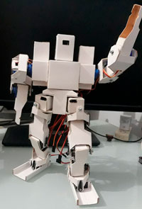

# Construcción: Primeros pasos

{ align=right } ¡Estás por construir un robot mini humanoide de 20 grados de libertad! ¡Felicitaciones!

Este un proyecto muy emocionante, y ciertamente puede ser un reto por momentos, pero no te preocupes, esta documentación busca guiarte en todo el proceso. Si desarrollas este proyecto en equipo, el proceso será mucho más rápido. Si lo desarrollas por tu cuenta, te recomiendo que avances de manera constante y en procesos cortos, una pieza a la vez.

La construcción tiene 5 etapas:

- Etapa 1: Obtener las partes de cartulina recortada. 
- Etapa 2: Calibrar los mico servos. 
- Etapa 3: Plegar las piezas de cartulina y unirlas con cola y/o silicona caliente. 
- Etapa 4: Ensamblar las piezas junto a los micro servos.
- Etapa 5: Cableado

Luego de concluida la construcción, pasaremos a la programación del robot. 
Pero antes de todo, debemos asegurarnos de tener todos los materiales.

## Materiales

Esta es la lista de materiales necesarios para construir a Yachaq.

Descripción                     |       Cantidad
------------------------------- | ----------------------
Micro servo MG90s               | 12
Micro servo SG90                | 8
ESP32CAM (con camara OV2640)*   | 1
Driver I2C PCA9685              | 2
Conversor FTDI USB              | 1
Fuente 5V - 5A                  | 1
Cable jumper 10cm MH            | 10
Stove Bolt 1/8"x1/2"            | 18
Tuerca cuadrada 1/8"            | 38
Cartulina dúplex (70x100cm)     | 1

\*Puede usar un *Arduino Nano*, en lugar de un módulo *ESP32CAM*. En ese caso, podrá construir a Yachaq, sin la opción de cámara. Tambien puede usar un *Arduino Nano* y un módulo de cámara adicional, pero hemos encontrado que esto es más costoso, que usar el módulo *ESP32CAM*.

Tambien sería muy recomendable, tener a la mano un *Arduino* y un *breadboard*, ya que con ellos es más fácil hacer la calibración de los micro servos.

## Herramientas necesarias

Para el proceso de ensamblaje necesitará:

- Tijeras
- Cortador (*cutter*)
- Regla
- Perforador de papel
- Pistola de silicona caliente
- Cautín para soldar 
- Alicate
- Destornillador
- Pegamento (cola)

