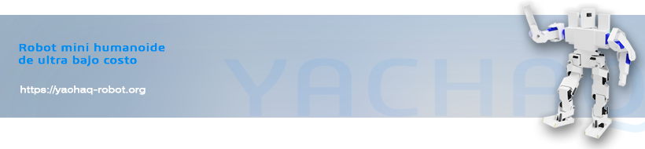
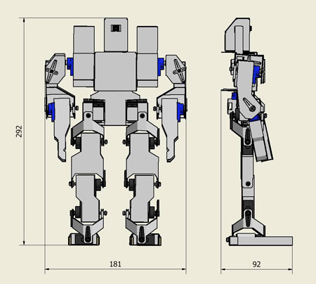

# Yachaq Robot

Bienvenid@ a la documentación oficial del proyecto [Yachaq Robot](https://yachaq-robot.org).

Yachaq, es una robot humanoide opensource, cuyo objetivo es facilitar el acceso a hardware de aprendizaje de robótica  humanoide. Está diseñado para ser lo más económico posible, manteniendo las mejores prestaciones. Esto incluye tambien la fabricación, ya que puedes construir el tuyo sin necesidad de tener una impresora 3D o una cortadora láser. 

## Características 

Sus principales características son:

 - Es un proyecto *opensource*, por lo que puedes construir tu propio robot *Yachaq*.
 - Tiene ***20 grados de libertad***. Son 6 en cada pierna, 3 por cada brazo, 1 en la cintura y 1 en el cuello.
 - Usa micro servos MG90s(x12) y SG90(x8).
 - Está controlado por un módulo ESP32CAM, compatible con Arduino IDE y librerías Arduino.
 - Tiene una cámara integrada que graba video 1080p @ 30fps.
 - Tiene conectividad Wifi y Bluetooth.
 - El costo de materiales es *menor a USD$ 100 dolares americanos* (depende de la ciudad en que te encuentres).

La disposición de los grados de libertad puede verse en la imagen siguiente.

 {: width=55% }

## Dimensiones

Las dimensiones generales de Yachaq son 181\*292\*92 mm, como se muestra en la imágen. 

Note que debido a los cables, la dimension de 92mm puede ser mayor en el robot, cuando esté completamente ensamblado.

## Como empezar

Ya estás en e lugar correcto. Puedes empezar aquí mismo, revisando la [lista de materiales](/construccion/#materiales). También puedes aprender el [proceso de construcción detallado](/construccion) y finalmente puedes aprender [como programar](/programacion/) tu robot.

## Siguientes pasos

Ahora que ya sabes que necesitarás, puedes visitar los pasos del [proceso de construcción](/construccion-primeros-pasos/).
